# 信息检索原理报告

## 项目概览


（上图是一张动图，可以访问github链接查看）

本项目是基于[新浪新闻中心](https://news.sina.com.cn/roll/)的内容构建的一个小型新闻搜索引擎Haogle，基本完成了HW5要求的所有内容。github链接：https://github.com/water-00/NKU-Information-Retrieval

本项目的框架如下：

```
├── figure
├── index
├── pagerank
├── recommend
├── search
├── server
├── snapshot
└── spider
```

- `figure`：报告的图片文件夹
- `index`：在Elasticsearch中构建索引
- `pagerank`：使用pagerank算法分析网页排名
- `recommend`：使用文本相似度分析得到每条新闻下方的推荐链接
- `search`：使用vue构建的搜索引擎前端
- `server`：使用flask框架构建的搜索引擎后端
- `snapshot`：获取并保存网页快照
- `spider`：新浪新闻中心的爬虫

## 网页抓取

在`spider`目录下，使用scrapy框架对新浪新闻中心的新闻进行爬取。使用多线程框架，每个类别的新闻分别爬取300条左右，提取内容并清洗，共计3465条，将其存入MongoDB数据库中。每条数据的包括内容如下：

```python
class NewsinaspiderItem(scrapy.Item):
    collection = 'newsina'
    ctime = Field()  # 发布时间
    url = Field()    # url
    wapurl = Field() # 移动端url
    title = Field()  # 新闻标题
    media_name = Field()  # 发发布的媒体
    keywords = Field()  #  关键词
    content = Field()  #  新闻内容
    page_link = Field() # 相关新闻
```

MongoDB中的内容样例如下：

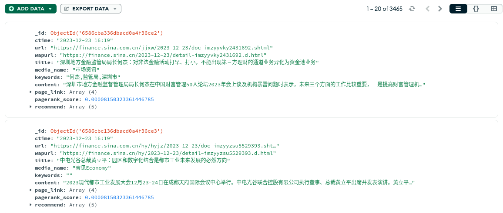

- page_link是每条新浪新闻页面下方推荐的新闻，搜集以用于pagerank算法分析。
- pagerank_score是经过pagerank算法后每个网页的评分，用于优化后续搜索。
- recommend是结合pagerank_score、文本向量化和文本相似度检测得到的每个新闻页面下的推荐新闻。

## 文本索引

在`index`目录下，使用[ik中文分词器](https://github.com/medcl/elasticsearch-analysis-ik/)对MongoDB中的内容进行分词，并构建Elasticsearch索引。

得到Elasticsearch中中文分词、建立倒排索引后的数据：

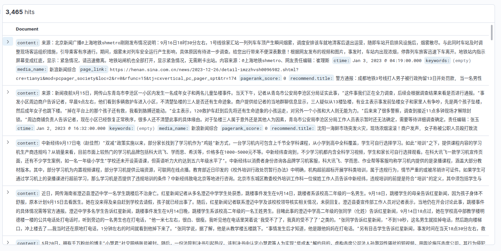

由于Elasticsearch的商业性和机密性，我们并不能查看构建完成后的倒排索引，但在搜索过程中Elasticsearch会根据其自身的算法和倒排索引结果给索引中每个网站一个评分以确定返回的搜索结果。

## 链接分析

完成pagerank算法，并将pagerank评分写入MongoDB，以提升查询服务

最后得到每个网页的pagerank_score并写入MongoDB，部分数据如下：

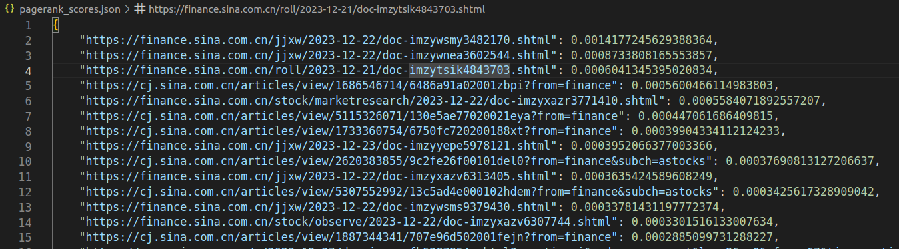

## 查询服务

这一部分的实现主要在`search`和`server`中

### 站内查询

示例：

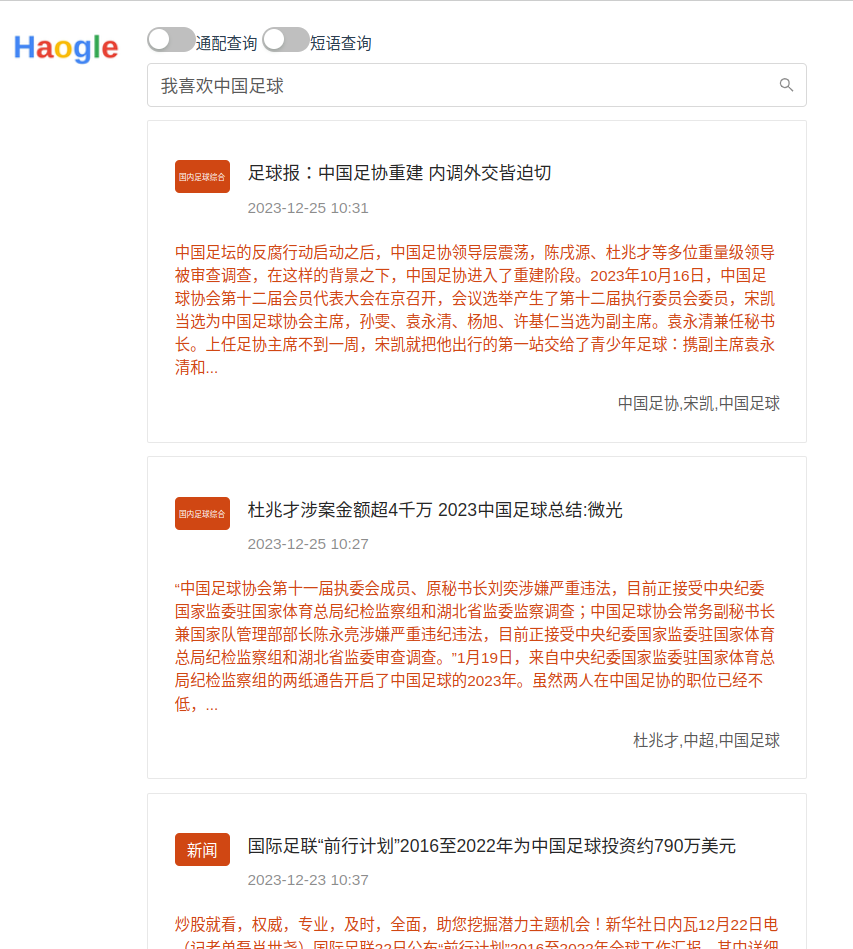

基本思路就是：点击搜索按钮时，vue控件调用onSearch()函数，其中会跳转到`\search`路由（在router.js中对应于SearchPage.vue）执行搜索，在SearchPage.vue的searchResult()函数中会创建url并用axios创递参数给后端执行搜索。

在flask后端`app.py`中会根据`\search`路由执行searchs()函数，根据参数执行普通查询、通配查询或是短语查询，并返回搜索结果、记录日志。

在普通查询函数search()中，程序会构造Elaseticesearch的dsl(Domain Specific Language, 领域特定语言)并在`["title", "keywords", "content"]`这三个字段上执行查询，使用ik_smart分析器。

### 短语查询

示例：

不打开短语查询：

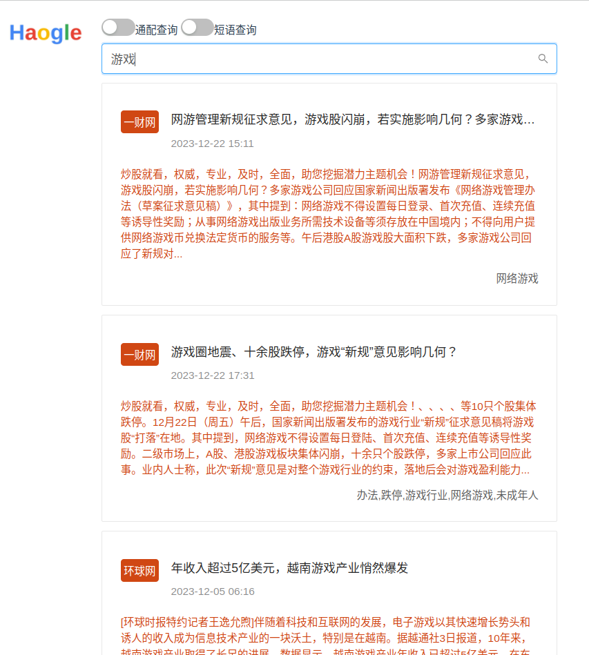

打开短语查询后：

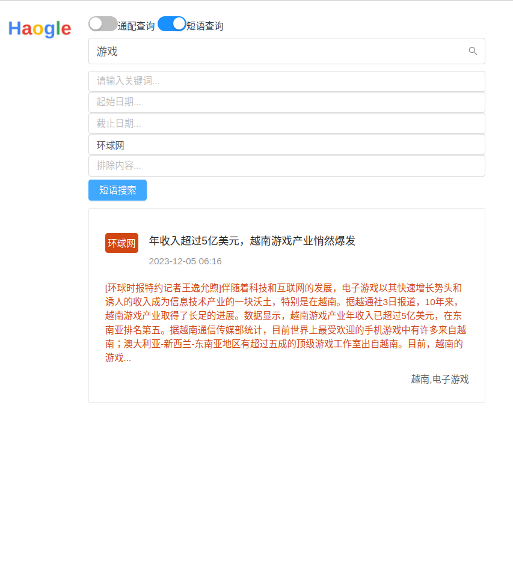

搜索过程已经介绍过一遍，短语查询的实现就是在`app.py`中通过前端在url中传递的`phrase`的内容来执行phraseSearch()函数，其在构建dsl时对要求的字段有更严格的匹配机制。

### 通配查询

未使用通配查询：

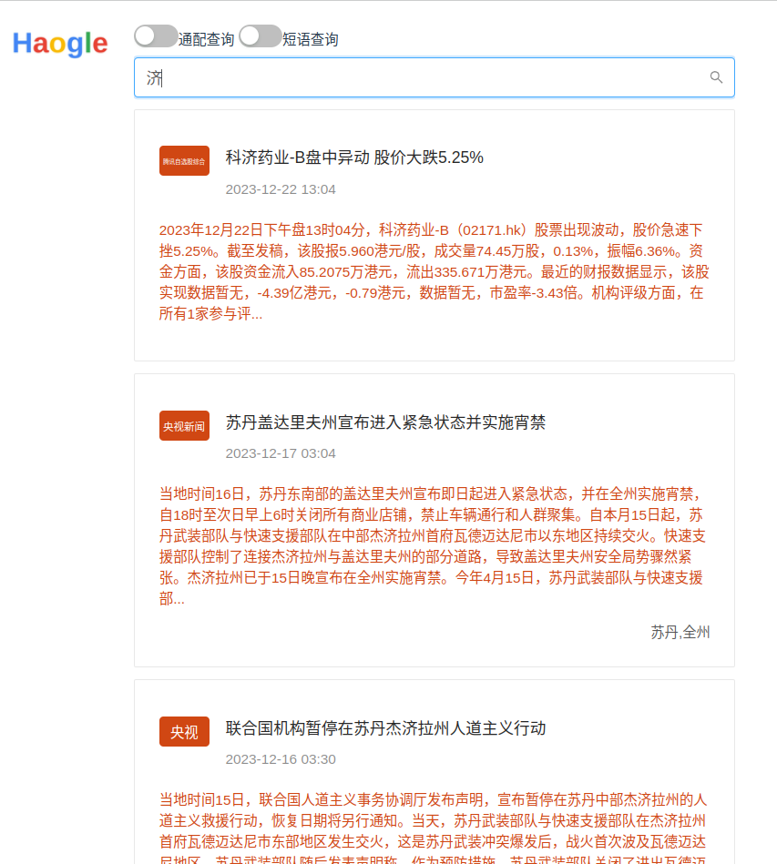

返回结果大多只与"济"单字有关。开启通配查询后：

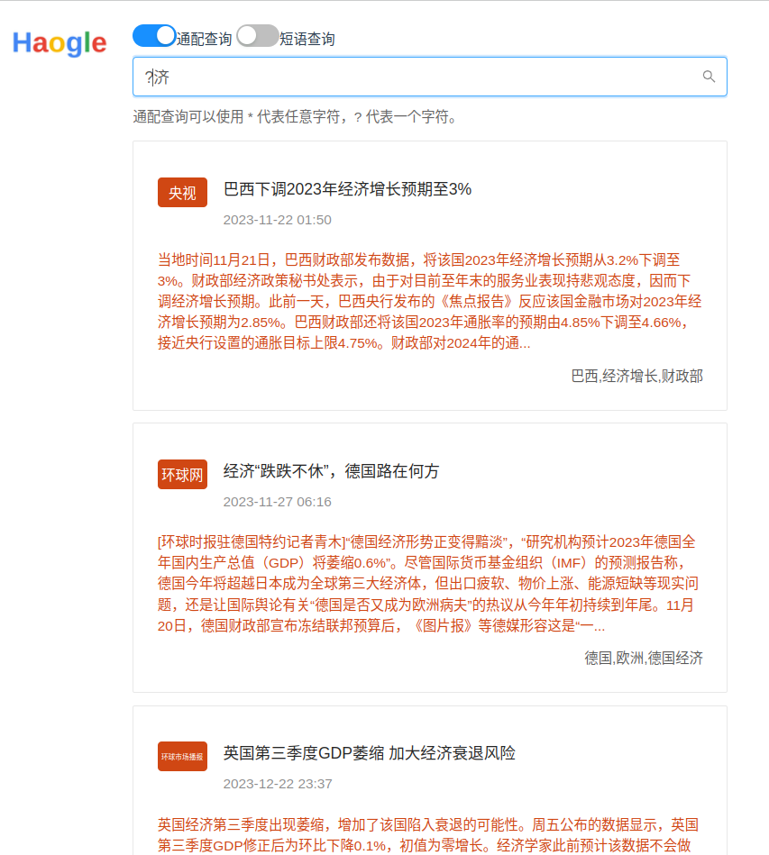

查询`?济`，返回结果就都包含含有“济”的二字词语（数据库中比较多的词语就是“经济”）。

实现方式就是在`app.py`通过前端传递的`wildcard`参数调用wildcardSearch()函数，其在构建dsl的时候会使用Elasticsearch的正则表达式匹配。

### 查询日志

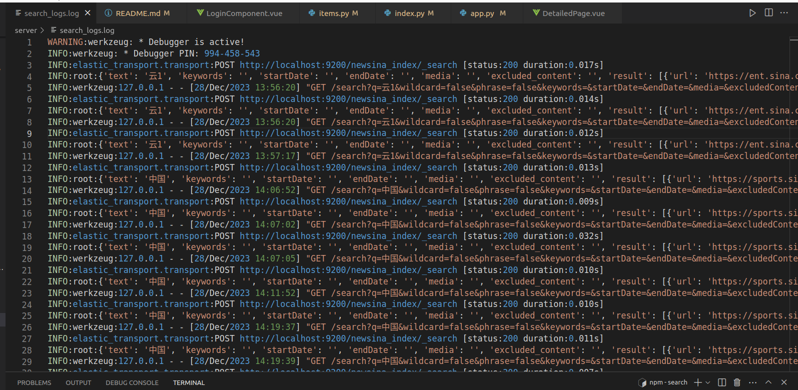

在`app.py`中每次查询之后都会保存日志，包括搜索内容、返回结果、错误信息（如有）

### 网页快照

在snapshot目录下，用selenium库的webdriver包模拟用chrome浏览器打开、浏览网页，等待一段时间加载完成，然后调用save_screenshot()函数完成屏幕快照，存储到本地。在前端每条新闻的详情页可以点击“网页快照”按钮显示快照。

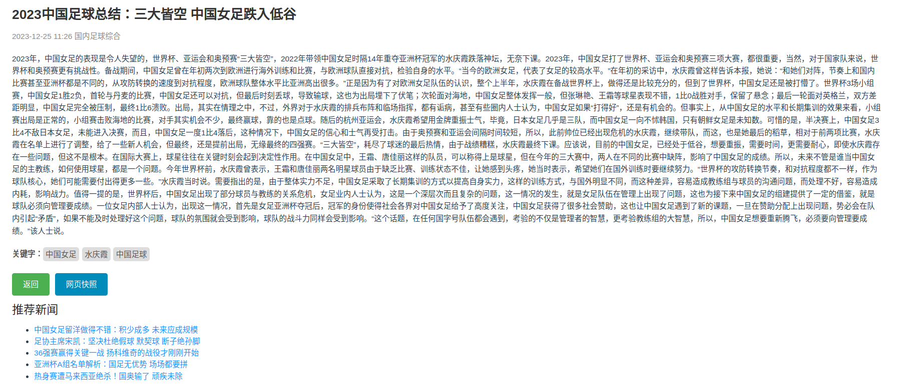

点击蓝色的“网页快照”按钮后打开：


## 个性化查询

实现了用户登录和存储历史记录，用户登录：


成功登陆后：

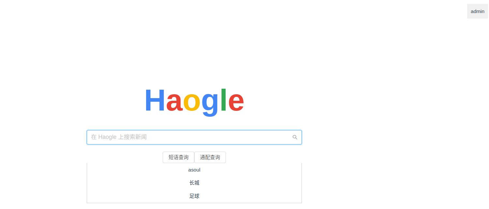

右上方会显示用户名，搜索框会显示搜索结果，日后可基于历史搜索结果进行搜索推荐，但是由于本项目数据库较小且领域仅局限于新闻，所以没有实现基于用户历史和个人信息的推荐系统。

## Web页面

使用vue框架实现web页面，主页面：


搜索结果页面：


新闻详情页面：

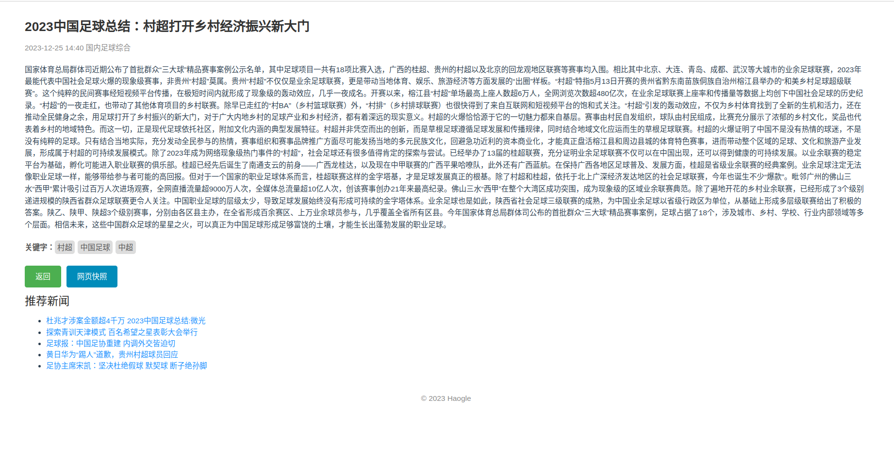

## 个性化推荐

在`recommend`目录下，使用文本相似度计算数据库中每条新闻最相关的5条新闻，并在前端显示上图中的蓝色链接，点击链接可以跳转到对应的url。推荐系统代码的具体过程如下：

1. **中文文本预处理**:
   - 使用结巴分词（`jieba`）对文本进行分词。
   - 从停用词文件中读取中文停用词，然后在分词过程中去除这些停用词。
2. **从MongoDB获取新闻数据**:
   - 代码从MongoDB集合中提取新闻数据。
   - 每条新闻数据包括标题和内容，这些被合并并通过预处理函数进行处理。
3. **TF-IDF特征提取**:
   - 使用`TfidfVectorizer`从预处理后的文本中提取TF-IDF特征。
   - TF-IDF（Term Frequency-Inverse Document Frequency）是一种统计方法，用于评估一个词语在一个文档集或语料库中的重要性。
4. **相似性计算和新闻推荐**:
   - 使用余弦相似性计算每篇新闻与语料库中其他新闻之间的相似性。
   - 对于每篇新闻，选择最相似的5篇新闻作为推荐。
5. **更新MongoDB文档的推荐结果**:
   - 将计算得到的推荐列表更新到MongoDB的相应新闻文档中。

最后，在前端请求信息，后端调取数据库内容返回即可。

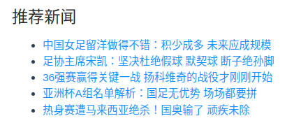